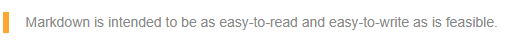

 <link href="./../../style.css" rel="stylesheet" type="text/css" />

 > Markdown’s syntax is intended for one purpose: to be used as a format for *writing* for the web.
 >
 > John Gruber


John Gruber, the author of {}, designed Markdown’s formatting syntax with the goal to make it as readable as possible. Markdown is a simple markup language that allows you to format plain text. It is a way to write content for the Web. Markdown language is simple to learn; it has minimal extra characters, so you can quickly write and make fewer errors.

## **Basic Markdown Syntax**
This article provides information on the main Markdown elements, details and examples of the Markdown syntax. A full list of all the Markdown syntax is declared in the [core Markdown specification](https://daringfireball.net/projects/markdown/) and [GitLab Flavored Markdown](https://docs.gitlab.com/ee/user/markdown.html) variation. All these features are supported by Aspose.HTML out-of-the-box.
### **Headers**
Markdown supports two styles of headers, [Setext](https://docutils.sourceforge.io/mirror/setext.html) and [atx](http://www.aaronsw.com/2002/atx/): To create an atx-style heading, add signs (#) at the start of the line. The number of signs you use should correspond to the heading level. **Note:** Always put a space between the number signs (#) and the heading name.

Alternatively, to create a setext-style heading, on the line below the text, add any number of `==` characters for heading level 1 or `--` characters for heading level 2.

| **Markdown Syntax**                                          | **HTML**                                       | **Rendered**                       |
| ------------------------------------------------------------ | ---------------------------------------------- | ---------------------------------- |
| # This is a Heading level 1                                  | &lt;h1&gt;This is a Heading level 1&lt;/h1&gt; | <h1>This is a Heading level 1</h1> |
| ## This is a Heading level 2                                 | &lt;h2&gt;This is a Heading level 2&lt;/h2&gt; | <h2>This is a Heading level 2</h2> |
| ### This is a Heading level 3                                | &lt;h3&gt;This is a Heading level 3&lt;/h3&gt; | <h3>This is a Heading level 3</h3> |
| ###### This is a Heading level 6                             | &lt;h6&gt;This is a Heading level 6&lt;/h6&gt; | <h6>This is a Heading level 6</h6> |
| This is a Heading level 1<br/>===================            | &lt;h1&gt;This is a Heading level 1&lt;/h1&gt; | <h1>This is a Heading level 1</h1> |
| This is a Heading level 2<br/>- - - - - - - - - - - - - - - - - - - | &lt;h2&gt;This is a Heading level 2&lt;/h2&gt; | <h2>This is a Heading level 2</h2> |

### **Emphasis**

Markdown treats asterisks * and underscores (_) as indicators of emphasis. To make text bold and italic at the same time, add three asterisks or underscores before and after the word or phrase. To make the middle of a word bold and italicize for emphasis, add three asterisks without spaces around the letters.

| **Markdown Syntax**                              | **HTML**                                                     | **Rendered**                                                 |
| ------------------------------------------------ | ------------------------------------------------------------ | ------------------------------------------------------------ |
| `*single asterisks*`                             | &lt;em&gt;single asterisks&lt;/em&gt;                        | <em>single asterisks</em>                                    |
| `_single underscores_`                           | &lt;em&gt;single underscores&lt;/em&gt;                      | <em>single underscores</em>                                  |
| `**double asterisks**`                           | &lt;strong&gt;double asterisks&lt;/strong&gt;                | <strong>double asterisks</strong>                            |
| `__	double underscores__`                     | &lt;strong&gt;double underscores&lt;/strong&gt;              | <strong>double underscores</strong>                          |
| `***Bold and Italic***`                          | &lt;strong&gt;&lt;em&gt;Bold and Italic&lt;/em&gt;&lt;/strong&gt; | <strong><em>Bold and Italic</em></strong>                    |
| `___Bold and Italic___`                          | &lt;strong&gt;&lt;em&gt;Bold and Italic&lt;/em&gt;&lt;/strong&gt; | <strong><em>Bold and Italic</em></strong>                    |
| `Make text bold***and***italic at the same time` | Make text bold&lt;strong&gt;&lt;em&gt;and&lt;/em&gt;&lt;/strong&gt;italic at the same time | Make text bold<strong><em>and</em></strong>italic at the same time |

### **Blockquotes**

Markdown language uses email-style `>` characters for blockquote. So, for blockquote creating, you should put a sign `>` before the first line of a hard-wrapped paragraph. If a blockquote contains multiple paragraphs, add a `>` on the blank lines between the paragraphs. Moreover, blockquotes can include other Markdown elements, including headers, emphasis, lists, or code snippets: Let's consider some usage examples:


| **Markdown Syntax**                                          | **Rendered**                |
| ------------------------------------------------------------ | ----------------------------------- |
| <pre>&gt; Markdown is intended to be as easy-to-read and easy-to-write as is feasible.</pre> |  |
| <pre>&gt; ## This is a header.<br/>&gt; <br/>&gt; 1.   This is the first list item.<br/>&gt; 2.   This is the second list item.<br/>&gt; <br/>&gt; Here's some example code:<br/>&gt; <br/>&gt;    using var document = new HTMLDocument();</pre> |  |


### **Markdown code blocks**

 **Code**

To indicate a span of code in the article text, wrap it with backtick quotes (`):

| **Markdown Syntax**                                     | **HTML**                                                     | **Rendered**                                            |
| ------------------------------------------------------- | ------------------------------------------------------------ | ------------------------------------------------------- |
| Load the HTML file using  &#96;HTMLDocument&#96;  class | Load the HTML file using &lt;code&gt;HTMLDocument&lt;/code&gt; class | Load the HTML file using <code>HTMLDocument</code>class |
| &#96;Use code in your Markdown file.&#96;               | &lt;code&gt;Use code in your Markdown file.&lt;/code&gt;     | <code>Use code in your Markdown file.</code>            |

 **Code Blocks**

To make a code block in Markdown, indent every line of the block by at least 4 spaces or 1 tab. In this example, leading spaces are indicated by periods: (⋅):

| **Markdown Syntax**         | **HTML**                                    | **Rendered**                |
| ----------------------------------- | ------------------------------------- | -------------------------- |
| This is a normal paragraph. | &lt;p&gt;This is a normal paragraph.&lt;/p&gt;         | <p>This is a normal paragraph.</p> |
| ⋅⋅⋅⋅This is a Markdown code block. |&lt;pre>This is a Markdown code block.&lt;/pre&gt;|<pre>This is a Markdown code block.</pre>|


### **Lists**

#### **Unordered Lists**

Markdown supports ordered (numbered) and unordered (bulleted) lists. Unordered lists use asterisks, pluses, and hyphens interchangeably as list markers. Begin lines with `*`, `+`, or `-`. To create a nested list, indent one or more items:

| <div style="width:200px">Markdown Syntax</div>               | <div style="width:200px">HTML</div>                          | <div style="width:200px">Rendered</div>                      |
| ------------------------------------------------------------ | ------------------------------------------------------------ | ------------------------------------------------------------ |
| \- First item<br/>\- Second item<br/>\- Third item<br/>\- Fourth item | <pre>&lt;ul><br/>&lt;li>First item&lt;/li><br/>&lt;li>Second item&lt;/li><br/>&lt;li>Third item&lt;/li><br/>&lt;li>Fourth item&lt;/li><br/></ul&gt;</pre> | <ul><li>First item</li><li>Second item</li><li>Third item</li><li>Fourth item</li></ul> |
| * First item<br/> * Second item<br/> * Blue<br/> * Black     | <pre>&lt;ul><br/>&lt;li>First item&lt;/li><br/>&lt;li>Second item&lt;/li><br/>&lt;li>Third item&lt;/li><br/>&lt;li>Fourth item&lt;/li><br/></ul&gt;</pre> | <ul><li>First itemd</li><li>Second item</li><li>Third item</li><li>Fourth item</li></ul> |
| + First item<br/> + Second item<br/> + Third item<br/> + Fourth item | <pre>&lt;ul><br/>&lt;li>First item&lt;/li><br/>&lt;li>Second item&lt;/li><br/>&lt;li>Third item&lt;/li><br/>&lt;li>Fourth item&lt;/li><br/></ul&gt;</pre> | <ul><li>First itemd</li><li>Second item</li><li>Third item</li><li>Fourth item</li></ul> |


#### **Ordered Lists**

To create an ordered list, add line items with numbers followed by periods. The list should start with number one. Then other numbers you use to mark the list have no impact on the HTML output Markdown gives.

| <div style="width:200px">Markdown Syntax</div>   | <div style="width:200px">HTML</div>                          | <div style="width:200px">Rendered</div>                      |
|  --------------------------------------------- | ------------------------------------------------------------ | ------------------------------------------------------------ |
| 1. Red<br/>1. Green<br/>1. Blue<br/>1. Black    | <pre>&lt;ol><br/>&lt;li>Red&lt;/li><br/>&lt;li>Green&lt;/li><br/>&lt;li>Blue&lt;/li><br/>&lt;li>Black&lt;/li><br/></ol&gt;</pre> | <ol><li>Red</li><li>Green</li><li>Blue</li><li>Black</li></ol> |
| 1. Red<br/> 2. Green<br/> 3. Blue<br/> 4. Black | <pre>&lt;ol><br/>&lt;li>Red&lt;/li><br/>&lt;li>Green&lt;/li><br/>&lt;li>Blue&lt;/li><br/>&lt;li>Black&lt;/li><br/></ol&gt;</pre> | <ol><li>Red</li><li>Green</li><li>Blue</li><li>Black</li></ol> |
| 1. Red<br/> 5. Green<br/> 3. Blue<br/> 8. Black | <pre>&lt;ol><br/>&lt;li>Red&lt;/li><br/>&lt;li>Green&lt;/li><br/>&lt;li>Blue&lt;/li><br/>&lt;li>Black&lt;/li><br/></ol&gt;</pre> | <ol><li>Red</li><li>Green</li><li>Blue</li><li>Black</li></ol> |

### **Images**
Inline image Markdown syntax looks like this:

 	
 	Example:
 	

You should add an exclamation mark (!), followed by alt text in square brackets, and the URL or path to the image in the parentheses. Where `Alt text for image` is a brief description of the image and `/path/to/img.jpg` is a relative path to the image. Alternate text is useful if the image can't render. The rendered output for the example Georgia.jpg looks like this:


## **Extended Markdown Syntax**

### **Links**

To create a link, write the link text in square brackets, and then follow it with the URL in parentheses. Links syntax looks like this:

 	Use [Markdown Converter](https://products.aspose.app/html/conversion/md) for converting Markdown files to a variety of popular formats.

The rendered link text looks like this:

Use [Markdown Converter](https://products.aspose.app/html/conversion/md) for converting Markdown files to a variety of popular formats.

**URLs and Email Addresses**

To quickly turn a URL or email address into a link, write it in angle brackets:

```
<https://docs.aspose.com/html/net/converting-between-formats/>
<html@example.com>
```

The rendered links to the URL and email address look like this:

<https://docs.aspose.com/html/net/converting-between-formats/>

<html@example.com>

**Image as a link**

To add a link to an image, enclose the Markdown for the image in brackets, and then add the link in parentheses. Markdown syntax for an image as a link  looks like this:
```
 [](https://products.aspose.app/html/conversion/md-to-pdf)
```
The rendered image as a link looks like this:

​    [](https://products.aspose.app/html/conversion/md-to-pdf)

### **Markdown table syntax**
Tables are often the best way to present some data, but formatting tables in Markdown is one of the trickiest. 
A table in Markdown consists of two parts: the header and the rows of data in the table. Tables are created using pipes (|) and hyphens (-). Use three or more hyphens (--) to create each column’s header, and use pipes (|) to separate each column.
The colons (:) used to align cell contents. The colons alongside to the left of the hyphen,  cause the column to be left-aligned and etc.

Here is an example of a Markdown table syntax:
```
| Header 1       | Header 2           | Header 3       |
| :------------- | :----------------: | -------------: |
| Cell Content 1 | Cell Content 2     | Cell Content 3 |
| Text           | Some long data here| Data           |
```
The rendered table looks like this:
| Header 1       | Header 2           | Header 3       |
| :------------- | :---------------:  | -------------: |
| Cell Content 1 | Cell Content 2     | Cell Content 3 |
| Text           | Some long data here| Data           |

[GitLab Flavored Markdown](https://docs.gitlab.com/ee/user/markdown.html) lets you create simple, easy-to-read tables. You can easily add Markdown syntax to tables, such as bold, italic, code blocks, HTML tags and more.